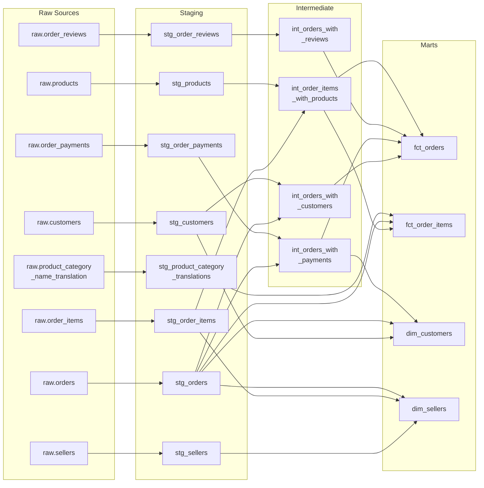

# Ecommerce Analytics — dbt Project


A production-ready dbt project that transforms raw **[Olist Brazilian Ecommerce](https://www.kaggle.com/datasets/olistbr/brazilian-ecommerce)** data in Snowflake into analytics-ready fact and dimension tables.

---

## Table of Contents
- [Overview](#overview)
- [Architecture](#architecture)
- [Data Sources](#data-sources)
- [Data Lineage](#data-lineage)
- [Models](#models)
- [Tests](#tests)
- [Project Structure](#project-structure)
- [Getting Started](#getting-started)
- [Key Business Questions](#key-business-questions)

---

## Overview

This project follows a **3-layer medallion architecture** — raw source data flows through staging and intermediate layers before landing in the marts layer as clean, business-ready tables.

| Layer | Schema | Purpose | Materialization |
|---|---|---|---|
| Staging | `staging` | 1:1 with raw sources, light cleaning only | View |
| Intermediate | `intermediate` | Joins and business logic | View |
| Marts | `marts` | Final fact and dimension tables for BI | Table |

**Stack:** dbt 1.11 · Snowflake · dbt-utils 1.3.0

---

## Architecture

```
┌──────────────────────────────────────────────────────────────────────┐
│                             SNOWFLAKE                                │
│                                                                      │
│  ┌───────────────┐   ┌────────────────┐   ┌──────────────────────┐  │
│  │   raw schema  │   │staging schema  │   │    marts schema      │  │
│  │               │   │                │   │                      │  │
│  │  9 raw tables │──▶│  9 stg_ views  │──▶│  fct_orders          │  │
│  │  (Olist data) │   │                │   │  fct_order_items     │  │
│  │               │   │                │   │  dim_customers       │  │
│  └───────────────┘   └───────┬────────┘   │  dim_sellers         │  │
│                               │            └──────────────────────┘  │
│                      ┌────────▼──────────────┐                       │
│                      │  intermediate schema  │                       │
│                      │                       │                       │
│                      │  int_orders_with_*    │                       │
│                      │  int_order_items_*    │                       │
│                      └───────────────────────┘                       │
└──────────────────────────────────────────────────────────────────────┘
```

---

## Data Sources

All raw data comes from the **Olist Brazilian Ecommerce** dataset, loaded into Snowflake under `ecommerce_dev.raw`.

| Source Table | Description | Freshness Check |
|---|---|---|
| `orders` | One row per order with status and timestamps | Warn: 7d · Error: 30d |
| `customers` | Customer demographics and location | — |
| `order_items` | One row per item in an order | Warn: 7d · Error: 30d |
| `order_payments` | Payment method and value per order | — |
| `order_reviews` | Customer review scores and comments | Warn: 7d · Error: 30d |
| `products` | Product dimensions and category | — |
| `sellers` | Seller location info | — |
| `geolocation` | Zip code to lat/lng mapping | — |
| `product_category_name_translation` | Portuguese → English category names | — |

---

## Data Lineage



---

## Models

### Staging Layer
Light transformations only — one model per source table. No joins, no business logic.

| Model | Source | Key Columns |
|---|---|---|
| `stg_orders` | `raw.orders` | `order_id`, `customer_id`, `order_status`, timestamps |
| `stg_customers` | `raw.customers` | `customer_id`, `customer_unique_id`, city, state |
| `stg_order_items` | `raw.order_items` | `order_id`, `product_id`, `seller_id`, `price`, `freight_value` |
| `stg_order_payments` | `raw.order_payments` | `order_id`, `payment_type`, `payment_value` |
| `stg_order_reviews` | `raw.order_reviews` | `order_id`, `review_score`, `review_comment_title` |
| `stg_products` | `raw.products` | `product_id`, `product_category_name`, dimensions |
| `stg_sellers` | `raw.sellers` | `seller_id`, city, state |
| `stg_geolocation` | `raw.geolocation` | `zip_code_prefix`, lat, lng |
| `stg_product_category_translations` | `raw.product_category_name_translation` | Portuguese → English category mapping |

---

### Intermediate Layer
Joins and aggregations that prepare data for the marts. Not intended for direct BI consumption.

| Model | Description | Grain |
|---|---|---|
| `int_orders_with_customers` | Orders joined with customer city/state | One row per order |
| `int_orders_with_payments` | Payment totals aggregated per order | One row per order |
| `int_orders_with_reviews` | Reviews cleaned and joined to orders | One row per review |
| `int_order_items_with_products` | Order items enriched with product dimensions | One row per order item |

---

### Marts Layer
Business-ready tables materialized as Snowflake tables. Designed for BI tools and analysts.

#### `fct_orders`
> One row per order — the central fact table.

| Column | Type | Description |
|---|---|---|
| `order_id` | PK | Unique order identifier |
| `customer_unique_id` | FK → `dim_customers` | True customer identifier |
| `order_status` | string | `delivered` / `shipped` / `canceled` / etc. |
| `total_payment_value` | float | Total amount paid (BRL) |
| `total_items` | int | Number of items in the order |
| `review_score` | int | Customer satisfaction score (1–5) |
| `delivery_days` | int | Days from purchase to delivery |
| `delivery_status` | string | `On Time` / `Late` |
| `days_early_or_late` | int | Days ahead (+) or behind (−) estimated delivery |

#### `fct_order_items`
> One row per order item — enables product and category-level analysis.

| Column | Type | Description |
|---|---|---|
| `order_id` | FK → `fct_orders` | Parent order |
| `seller_id` | FK → `dim_sellers` | Seller who fulfilled the item |
| `product_category_name_english` | string | English product category |
| `price` | float | Item price (BRL) |
| `freight_value` | float | Freight cost (BRL) |
| `freight_pct_of_price` | float | Freight as % of item price |

#### `dim_customers`
> One row per unique customer — includes lifetime value and segmentation.

| Column | Type | Description |
|---|---|---|
| `customer_unique_id` | PK | True unique customer identifier |
| `total_orders` | int | Total orders placed |
| `lifetime_value` | float | Total spend across all orders (BRL) |
| `avg_order_value` | float | Average order value (BRL) |
| `customer_age_days` | int | Days between first and most recent order |
| `customer_segment` | string | `Champion` / `Loyal` / `Returning` / `One Time` |
| `ltv_segment` | string | `High Value` / `Mid Value` / `Low Value` |

**Segmentation rules:**

```
customer_segment        ltv_segment
──────────────────      ──────────────────────────
Champion  → 5+ orders   High Value → ≥ 1,000 BRL
Loyal     → 3–4 orders  Mid Value  → ≥ 300 BRL
Returning → 2 orders    Low Value  → < 300 BRL
One Time  → 1 order
```

#### `dim_sellers`
> One row per seller — includes revenue metrics and performance tier.

| Column | Type | Description |
|---|---|---|
| `seller_id` | PK | Unique seller identifier |
| `total_orders` | int | Total distinct orders fulfilled |
| `total_revenue` | float | Sum of item prices sold (BRL) |
| `avg_item_price` | float | Average item price (BRL) |
| `seller_tier` | string | `Platinum` / `Gold` / `Silver` / `Bronze` |

**Tier rules:**

```
Platinum → total_revenue ≥ 50,000 BRL
Gold     → total_revenue ≥ 20,000 BRL
Silver   → total_revenue ≥  5,000 BRL
Bronze   → total_revenue <  5,000 BRL
```

#### Snapshots

| Snapshot | Strategy | Tracked Column | Purpose |
|---|---|---|---|
| `scd_orders` | check | `order_status` | Captures every status change over time (SCD Type 2) |

---

## Tests

The project has **85 data tests** across all layers:

| Test Type | Description |
|---|---|
| `not_null` | Primary and foreign keys on all models |
| `unique` | Primary keys on all fact and dimension tables |
| `accepted_values` | `order_status`, `payment_type`, `review_score`, `customer_segment`, `ltv_segment`, `seller_tier`, `delivery_status` |
| `relationships` | `fct_orders → dim_customers`, `fct_order_items → fct_orders`, `fct_order_items → dim_sellers` |
| Singular tests | `assert_positive_delivery_days` — delivered orders must have `delivery_days > 0` |
| Singular tests | `assert_valid_review_scores` — review scores must be between 1 and 5 |

---

## Project Structure

```
ecommerce_analytics/
│
├── models/
│   ├── staging/
│   │   ├── sources.yml                            # Source definitions + freshness checks
│   │   ├── schema.yml                             # Staging model docs + tests
│   │   ├── stg_orders.sql
│   │   ├── stg_customers.sql
│   │   ├── stg_order_items.sql
│   │   ├── stg_order_payments.sql
│   │   ├── stg_order_reviews.sql
│   │   ├── stg_products.sql
│   │   ├── stg_sellers.sql
│   │   ├── stg_geolocation.sql
│   │   └── stg_product_category_translations.sql
│   │
│   ├── intermediate/
│   │   ├── schema.yml
│   │   ├── int_orders_with_customers.sql
│   │   ├── int_orders_with_payments.sql
│   │   ├── int_orders_with_reviews.sql
│   │   └── int_order_items_with_products.sql
│   │
│   └── marts/
│       ├── schema.yml
│       ├── fct_orders.sql
│       ├── fct_order_items.sql
│       ├── dim_customers.sql
│       └── dim_sellers.sql
│
├── snapshots/
│   └── scd_orders.sql                             # Order status history (SCD Type 2)
│
├── tests/
│   ├── assert_positive_delivery_days.sql
│   └── assert_valid_review_scores.sql
│
├── macros/
│   └── generate_schema_name.sql                   # Prevents dev_staging / dev_marts naming in Snowflake
│
├── packages.yml                                   # dbt-utils dependency
├── dbt_project.yml                                # Project config + segmentation vars
└── .gitignore
```

---

## Getting Started

### Prerequisites
- Python 3.8+
- dbt-core 1.11+ and dbt-snowflake adapter
- Snowflake account with access to `ecommerce_dev.raw`

### Installation

```bash
# Clone the repository
git clone https://github.com/<your-username>/ecommerce_analytics.git
cd ecommerce_analytics

# Install dbt (if not already installed)
pip install dbt-snowflake

# Install dbt package dependencies
dbt deps
```

### Configure Snowflake Connection

Create `~/.dbt/profiles.yml` — **do not commit this file, it contains credentials:**

```yaml
ecommerce_analytics:
  target: dev
  outputs:
    dev:
      type: snowflake
      account: <your_account>
      user: <your_username>
      authenticator: externalbrowser   # for MFA accounts
      role: <your_role>
      database: ecommerce_dev
      warehouse: <your_warehouse>
      schema: dev
      threads: 4
```

### Run the Project

```bash
# Verify connection
dbt debug

# Check source freshness
dbt source freshness

# Run all models
dbt run

# Run all tests
dbt test

# View docs and lineage graph
dbt docs generate
dbt docs serve --port 8001
# → Open http://localhost:8001
```

### Useful Selectors

```bash
dbt run --select staging            # staging layer only
dbt run --select +fct_orders        # fct_orders and all upstream models
dbt run --select tag:marts          # all mart models
dbt test --select fct_orders        # tests for a single model
```

---

## Key Business Questions

| Question | Model |
|---|---|
| What is the order fulfillment rate by status? | `fct_orders.order_status` |
| How many orders are delivered on time vs late? | `fct_orders.delivery_status` |
| Who are our highest-value customers? | `dim_customers.ltv_segment` |
| Which product categories generate the most revenue? | `fct_order_items` |
| Which sellers are top performers? | `dim_sellers.seller_tier` |
| How has an order's status changed over time? | `scd_orders` snapshot |
| What is the average freight cost as % of item price? | `fct_order_items.freight_pct_of_price` |
| What payment methods do customers prefer? | `fct_orders.payment_type` |
| What is the average delivery time by state? | `fct_orders` — `delivery_days` + `customer_state` |
| Which customers are at risk of churn? | `dim_customers` — `customer_segment = 'One Time'` |
